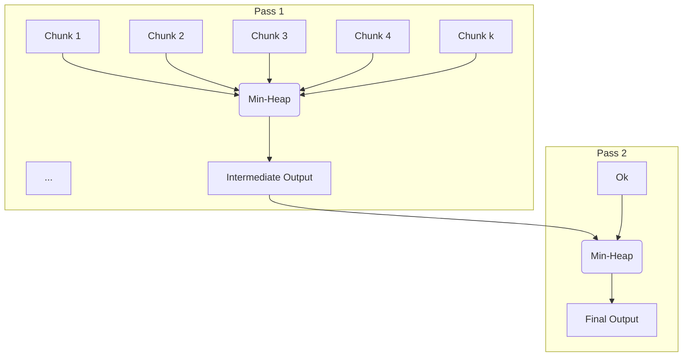

# split_merge_hub_demo

A high-performance tool for merging and sorting large CSV files in parallel, with robust shell orchestration and locale-aware number formatting.

---

## How to Run

1. **Prepare Input Files**
   - Place your large CSV files (e.g., `account*.csv`) in the `large_files/` directory.
   - To generate mock files:  
     ```sh
     ./run_mockup.sh
     ```

2. **Run the Merge Script**
   - The main orchestrator is `run.sh`, which auto-builds the Rust binary and runs the merge:
     ```sh
     ./run.sh
     ```
   - The script will:
     - Check for input files and system memory
     - Build the Rust binary (with optimizations)
     - Run the merge, sort, and output summary

### Run Flow Diagram
```mermaid
flowchart TD
    A[Start: run.sh] --> B{Check input directory\nand files}
    B -- Not found --> Z1[Error & Exit]
    B -- Found --> C[Build Rust binary]
    C -- Build fail --> Z2[Error & Exit]
    C -- Build OK --> D[Detect system memory,\nprepare parameters]
    D --> E[Show summary & parameters]
    E --> F[Run Rust merge binary]
    F --> G[Validate headers]
    G -- Mismatch --> Z3[Error & Exit]
    G -- OK --> H[Split each CSV file\ninto chunks (parallel)]
    H --> I[Sort each chunk\nby key (parallel)]
    I --> J[Write sorted chunks\nto temp files]
    J --> K[Merge sorted chunks\nusing k-way merge]
    K --> L[Write merged output\nto final CSV]
    L --> M[Show summary:\nfile size, records, speed, time]
    M --> N[Done]
    Z1["❌ Error: Input directory or files not found"]
    Z2["❌ Error: Build failed"]
    Z3["❌ Error: Header mismatch"]
```

---

## Merge Algorithm (Rust Core)

The core merging is performed in parallel for maximum speed and efficiency, using a chunked k-way merge strategy.

### Steps:
1. **Validate Headers**: Ensure all input CSVs have matching headers.
2. **Split Phase**: For each file:
    - Split into memory-sized chunks
    - Sort each chunk in parallel by the specified key(s)
    - Write sorted chunks to temporary files
3. **Merge Phase**:
    - Perform a k-way merge (configurable, default k=12) on all sorted chunks
    - Merge in passes if there are more than k chunks
    - Write the final merged, sorted output

### Merge Algorithm Diagram
```mermaid
flowchart TD
    A[Input CSV files] --> B[Split into chunks]
    B --> C[Sort each chunk (parallel)]
    C --> D[Write sorted chunk files]
    D --> E[k-way merge sorted chunks]
    E --> F[Final merged CSV]
```

---

## K-way Merge Algorithm Explained

The k-way merge is an efficient algorithm for merging multiple sorted files (chunks) into a single sorted output. Instead of merging two files at a time, it merges up to k files in each pass, minimizing the number of passes and disk I/O.

**How it works:**
- All sorted chunk files are opened.
- A min-heap (priority queue) is used to always select the smallest current record among all open files.
- The smallest record is written to the output, and the next record from that file is pushed into the heap.
- This repeats until all files are exhausted.
- If there are more than k chunks, multiple merge passes are performed until only one output remains.

**Advantages:**
- Greatly reduces disk I/O and temporary files compared to 2-way merging.
- Can be tuned for available memory and file descriptor limits by adjusting k.

### K-way Merge Diagram


---

## Parameters Used by run.sh

The shell script `run.sh` sets several parameters that control performance and behavior:

| Parameter              | Source/How to Set      | Role/Description                                                                 |
|------------------------|-----------------------|----------------------------------------------------------------------------------|
| `MERGE_K`              | Env var in run.sh     | Number of files merged at once in k-way merge (higher = fewer passes, more RAM)   |
| `MERGE_BUF_MB`         | Env var in run.sh     | Buffer size (MB) for reading/writing during merge                                 |
| `MERGE_PARALLEL_GROUPS`| Env var in run.sh     | Number of parallel merge groups (affects concurrency)                             |
| `CHUNK_SIZE_MB`        | Calculated in run.sh  | Size (MB) of each chunk for splitting input files                                 |
| `RUST_LOG`             | Env var in run.sh     | Logging level for Rust binary (e.g. debug, info)                                  |
| `RUST_LOG_STYLE`       | Env var in run.sh     | Log style (always, auto, never)                                                   |
| `SORT_BY`              | run.sh variable       | Which column to sort by (passed to Rust binary)                                   |
| `INPUT_DIR`/`OUTPUT_DIR`| run.sh variables     | Input/output directory locations                                                  |

**How they affect the merge:**
- `MERGE_K`: Larger values speed up merging but use more RAM/file handles.
- `CHUNK_SIZE_MB`: Bigger chunks = fewer files, but need more RAM per chunk.
- `MERGE_BUF_MB`: Higher buffer = faster I/O, but more memory used.
- `MERGE_PARALLEL_GROUPS`: More groups = more parallelism, but can saturate CPU/disk.
- `SORT_BY`: Determines the key for sorting/merging.

You can adjust these in `run.sh` before running, or override with environment variables.

---

## Features
- Parallel chunked sorting and merging for huge CSVs
- Locale-aware number formatting (comma-separated)
- Robust shell script for orchestration (bash/zsh, macOS/Linux)
- Clear summary and error output

---

## Requirements
- Rust (for the core binary)
- Bash or Zsh shell
- `gawk` (optional, for pretty number formatting)
- `numfmt` (optional, for human-readable sizes)

---

## License
See [LICENSE](LICENSE).
